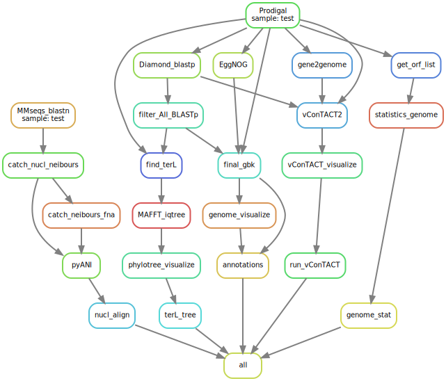
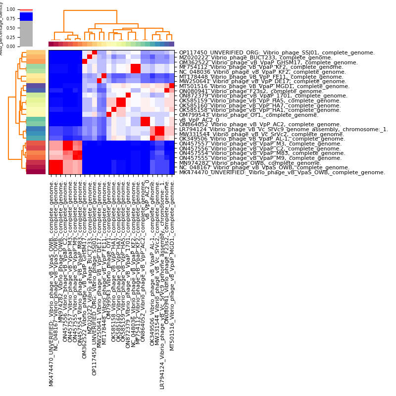
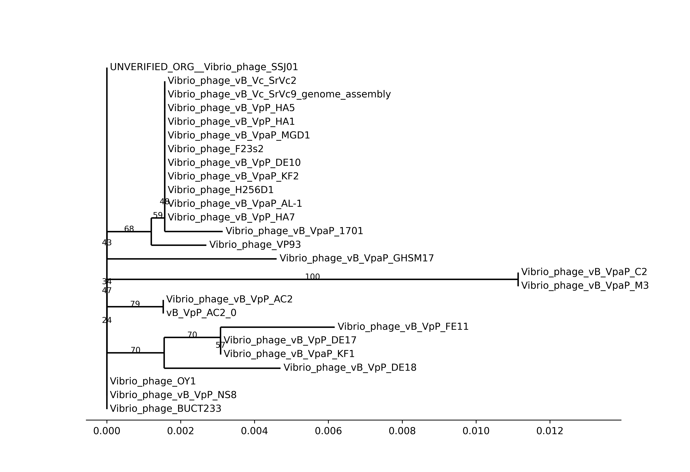
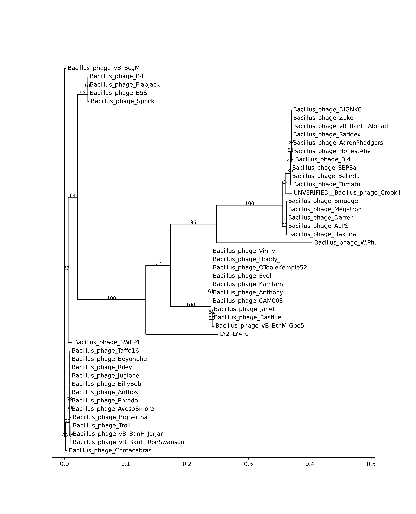

# PhageSnake
The PhageSnake was a basic automated bacteriophage(phage) genome analysis protocol, coded by Snakemake.
The input was only phage genomic assembly in FASTA format.
If the input FASTA file contains multiple contigs, each contig will be run independently.

# Usage
## 0. Installation
### 0.1 Environment setting

It was easier to rebuild an environment by CONDA.
Used software was listed in `./envs/phagesnake.yaml`.

```bash
conda create -n phagesnake -f ./envs/phagesnake.yaml
conda activate phagesnake
conda install snakemake
```

### 0.2 Database download

The used database would download from [INPHARED](https://github.com/RyanCook94/inphared).
The location of the download database is set in `config.yaml`, and an absolute path is recommended here.
The "db_prefix" was a time of database, e.g. `1Oct2022`.

```bash
snakemake -s ./rules/setup.smk --cores 60
```

## 1. Input setting
All the input files were phage nucleotide genome assemblies in FASTA type.
They would be copied into a new folder, default input directory was set as `fna_files`, but could be changed in `config.yaml`.

## 2. Run protocol
When all configurations were correct, the protocol could run easily as follow:

```bash
conda activate phagesnake
snakemake -s phagesnake.smk --cores 60
```

If **Cluster Server** was available, the protocol also could run as follow:

```bash
conda activate phagesnake
snakemake -s phagesnake.smk --cluster 'qsub -d . -e error.log -o output.log' -j 4
```

# The parts of the PhageSnake
The Directed Acyclic Graph(DAG) plot of PhageSnake was here:



## 1. Nucleotide alignment protocol
This protocol part was present as `nucl_align` in the DAG plot.

- [MMseqs2](https://github.com/soedinglab/MMseqs2) was used to align the phage genome with the INPHARED database. The output in this step is `blastn.tsv`.
- The `blastn.tsv` was filtered by **identity > 75%** and **coverage > 75%**(The coarse genus range) of alignment, and the output file was `blastn.list`, it recorded NCBI genome accession ids.
- Using the acc. ids to catch the sequence and calculate Average Nucleotide Identity(ANI).
- ANI was calculated by [pyani](https://github.com/widdowquinn/pyani), the final output file were all in `ANI_output`, and `ANIb_percentage_identity` was used to claim the identities between the phages.

## 2. Annotation protocol
This protocol part was present as `annotations` in the DAG plot.

- To find Open Reading Frames(ORFs), [Prodigal](https://github.com/hyattpd/Prodigal) was used with `-c` option, only to save closed ORFs.
- To get protein alignments, the accelerated NCBI BLAST+ tool [DIAMOND](https://github.com/bbuchfink/diamond) with INPHARED database were used.
- For more annotation(KEGG, GO, EC, Pfam, etc.), [EggNOG](https://github.com/eggnogdb/eggnog-mapper) with its database was used.
- Finally, comprehensively considered the protein annotations in alignments, using [Biopython](https://github.com/biopython/biopython) to make the final annotated genome: `.gbk`.
- The genome visualization was plotted using [Dna Features Viewer](https://github.com/Edinburgh-Genome-Foundry/DnaFeaturesViewer). In the genome plot, the colors of ORFs mean different functions of phage:

| Color                                             |    Function    |
| ------------------------------------------------- | :------------: |
| <font color="grey">$\blacksquare$</font> Grey       |  Hypothetical  |
| <font color="red">$\blacksquare$</font> Red         | DNA metabolism |
| <font color="orange">$\blacksquare$</font> Orange   |     Lytic      |
| <font color="blue">$\blacksquare$</font> Blue       |    Package     |
| <font color="skyblue">$\blacksquare$</font> SkyBlue |   Structure    |
| <font color="Green">$\blacksquare$</font>  Green    | Host dependent |

## 3. TerL Tree protocol
This protocol part was present as `terL_tree` in the DAG plot.

Terminase Large subunit(TerL) was a common gene in phages(but not in every phage), so it was always used for phylogenetic analysis.

- First, prepare for analysis. To get TerL, used alignment output from the [Annotation protocol](#2-annotation-protocol). The TerL of the phage was found in annotations of it, and others were found in protein alignment.
- Then, [MAFFT](https://github.com/GSLBiotech/mafft) was used to align all TerLs and [IQ-Tree](https://github.com/iqtree/iqtree2) to build a phylogenetic tree.
- Finally, visualization of the tree was plotted by the `Phylo` package of [Biopython](https://github.com/biopython/biopython)

## 4. vConTACT protocol (Optional) (In beta)
This protocol part was present as `run_vConTACT` in the DAG plot.

- First, input files of vConTACT were also collected from the [Annotation protocol](#2-annotation-protocol).
- Then, an accelerated method from [MetaPhage](https://github.com/MattiaPandolfoVR/MetaPhage) was used in this protocol.
- Finally, visualization of the network was plotted by [graphanalyzer](https://github.com/lazzarigioele/graphanalyzer), it was also recommended in the article provided accelerated method. This step is in beta.

The accelerated method was successful, but would also be taken a very long time in vConTACT calculation. So, this part was optional. It meant the phages were novel enough and it was necessary to get taxonomy around the genus level, this part was recommended.
If this part was necessary, set `run_vConTACT` as `True` in `config.yaml` (default was `False`).

 ## 5. Genome statistic protocol
This protocol part was present as `genome_stat` in the DAG plot.

- Only python was used to statistic GC%, length, and ORFs number.

# Sample and output
## sample data

The sample datas were in `fna_files`. Here, two types of input FASTA format showed. All of samples downloaded from [NCBI Genbank](https://www.ncbi.nlm.nih.gov/genbank/) database.

1. The assembly only had 1 contig was the best. In sample datas, `vB_VpP_AC2.fasta` had a complete genome. The genome of this single contig was recommended.

2. Sometimes, the phage genome assembly had multiple genomes. Each contig of assembly should be considered a separate genome. In sample datas, `LY2_LY4.fasta` had multiple genomes. In the default PhageSnake protocol, it would be divided into contigs and analysis one by one. If contig length was lower then 5000 bp, it would be skipped.

##  Result

All results were in `output`.

### ANI output

AC2: 

### Annotation output

The arrow plot from `.gbk`.

AC2: 

LY2: 

LY4: 

### TerL tree output

AC2: 

LY2: 

### Genome Statistic

[genome_statistic](seq_info.tsv)

# Other tips
### rerun
Often, the outputs were unsatisfactory, the middle file could be changed by hand, then rerun the protocol. In another way, build a new small protocol for optimization was also recommended.

When rerun protocol, the files marked as `protected()` should be delete, except the **ProtectedOutputException**, then rerun it.
To except this **Exception**, could run with `--dry-run` to check.

```bash
# check the protocol
snakemake -s phagesnake.smk --dry-run -R
```