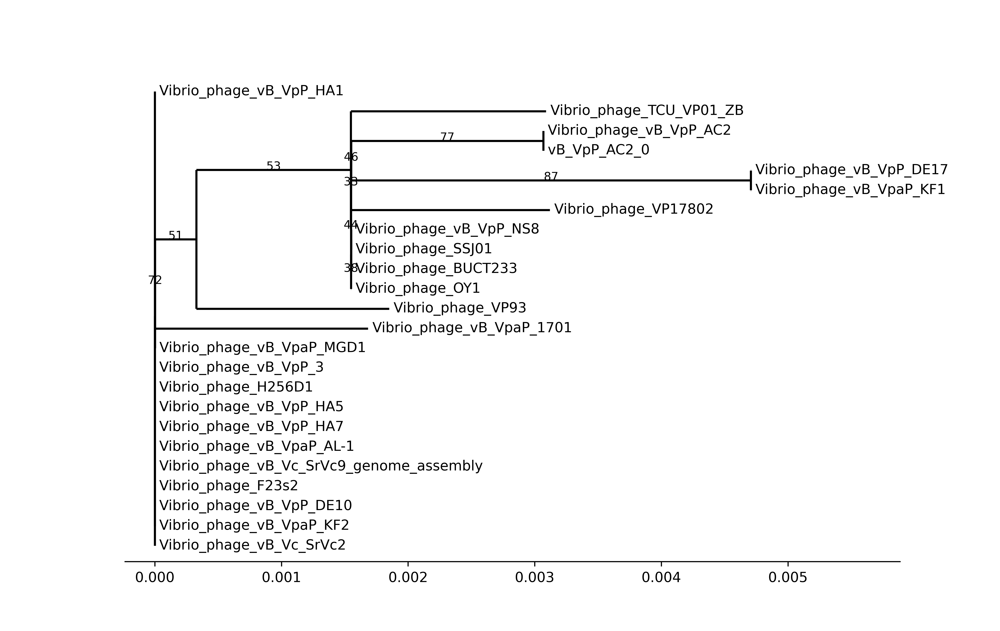

# PhageSnake

PhageSnake is a basic automated bacteriophage(phage) genome analysis workflow, coded by Snakemake.
PhageSnake runs on Linux platform.
Phagesnkae was designed to make phage genome analysis easy by creating an all-in-one workflow.

The [light release](https://github.com/rockNhu/phagesnake/releases/tag/alpha) is recommand to use.
Or the whole git is available to download by
`git clone https://github.com/rockNhu/phagesnake.git`

## Usage

### 0. Installation

#### 0.1 Environment setting

It was easier to rebuild an environment by [CONDA](https://github.com/conda/conda).
Used software was listed in `./envs/phagesnake.yaml`.

```bash
cd phagesnake
conda create -n phagesnake -f ./envs/phagesnake.yaml
```

#### 0.2 INPHARED Database download and pre-alignment

The database would download from [INPHARED](https://github.com/RyanCook94/inphared).
The location of the download database is set in `config.yaml`, and an absolute path is recommended.
The "db_prefix" parameter was the time INPHARED database updated, e.g. `1Sep2024`.
Also, the `1Sep2024` database and pre-alignment is [allVSall.dm.tsv.gz](https://github.com/rockNhu/phagesnake/releases/download/alpha/allVSall.dm.tsv.gz)

```bash
gunzip Database/*
```

Or the database could be updated by hand use the `setup.smk`.
And the `setup.smk` is to autonomous download use the "db_prefix" in `config.yaml`.

```bash
conda activate phagesnake
snakemake -s scripts/database_install/setup.smk --cores 40
```

#### 0.3 EggNOG database download

```bash
conda activate phagesnake
download_eggnog_data.py --data-dir Database
```

#### 0.4 VIRIDIC-dependent R package download

```bash
R 
```

```R
options(repos=c(CRAN="https://cloud.r-project.org/"))
install.packages("stringr")
install.packages("magrittr")
install.packages("dplyr")
install.packages("tibble")
install.packages("purrr")
install.packages("tidyr")
install.packages("ggplot2")
install.packages("DT")
install.packages("shiny")
install.packages("shinyjs")
install.packages("shinyWidgets")
install.packages("shinythemes")
install.packages("seqinr")
install.packages("BiocManager")
BiocManager::install("IRanges")
install.packages("reshape2")
install.packages("pheatmap")
install.packages("fastcluster")
install.packages("parallelDist")
install.packages("furrr")
install.packages("future")
BiocManager::install("ComplexHeatmap")
```

### 1. Input setting

**All the input files were phage nucleotide genome assemblies in FASTA type, them will be put in `fna_files` in default setting.**
They would be copied into a new folder, default input directory was set as `fna_files`, it could be changed in `config.yaml`.

### 2. Run workflow

When all configs were correct, the workflow could run easily.

```bash
conda activate phagesnake
snakemake -s phagesnake.smk --cores 6
```

If **Cluster Server** was available, the workflow also could run as follow:

```bash
conda activate phagesnake
snakemake -s phagesnake.smk --cluster 'qsub -d . -e error.log -o output.log' -j 4
```

## The parts of the PhageSnake

The Directed Acyclic Graph(DAG) plot of PhageSnake:


The common used Directed Acyclic Graph(DAG) plot of PhageSnake:


You can change the corresponding settings in `config.yaml`

### 1. Annotation sub-workflow

This sub-workflow part present as `annotations` in the DAG plot.

- To find Open Reading Frames(ORFs), [Prodigal](https://github.com/hyattpd/Prodigal) was used with `-c` option, only to save closed ORFs.
- To get protein alignments, the accelerated NCBI BLAST+ tool [DIAMOND](https://github.com/bbuchfink/diamond) with INPHARED database was used.
- For more annotation(KEGG, GO, EC, Pfam, etc.), [EggNOG](https://github.com/eggnogdb/eggnog-mapper) with its database was used.
- Finally, comprehensively considered the protein annotations in alignments, using [Biopython](https://github.com/biopython/biopython) to make the final annotated genome: `.gbk`.
- The genome visualization was plotted using [Dna Features Viewer](https://github.com/Edinburgh-Genome-Foundry/DnaFeaturesViewer). In the genome plot, the colors of ORFs mean different functions of phage:
- To check drug resistance genes and viral factors in the genome, ABRicate was used to align the genome to its database. Finally, output `abr_check.tsv`. If `abr_check.tsv` is empty, the genome was safe for humans.

| Color                                             |    Function    |
| ------------------------------------------------- | :------------: |
| <font color="grey">$\blacksquare$</font> Grey       |  Hypothetical  |
| <font color="red">$\blacksquare$</font> Red         | DNA metabolism |
| <font color="orange">$\blacksquare$</font> Orange   |     Lytic      |
| <font color="blue">$\blacksquare$</font> Blue       |    Package     |
| <font color="skyblue">$\blacksquare$</font> SkyBlue |   Structure    |
| <font color="Green">$\blacksquare$</font>  Green    | Host dependent |

### 2. Genome statistic sub-workflow

This sub-workflow was present as `genome_stat` in the DAG plot.

- Statistic GC%, scaffolds number, length, and ORFs number, only Python was used.

|Statistics|Description|
|----------|:------------:|
|GC%|(G+C)% in whole genome|
|scaffolds number|Scaffolds of genome, to check the genome quality|
|length|How many base pairs in genome|
|ORFs number|Predict Open Reading Frames number in genome|

### 3. Nucleotide alignment sub-workflow

This sub-workflow part present as `nucl_align` in the DAG plot. It is a taxonomy-related workflow. Align to the neibour genomes could show what species it is.

- [MMseqs2](https://github.com/soedinglab/MMseqs2) was used to align the phage genome with the INPHARED database. The output in this step is `blastn.tsv`.
- The `blastn.tsv` was filtered by **identity > 75%** and **coverage > 75%**(The coarse genus range) of alignment, and the output file was `blastn.list`, it recorded NCBI genome accession ids.
- Using the "acc." ids to catch the sequence and calculate Average Nucleotide Identity(ANI).
- ANI was calculated by [VIRIDIC](https://rhea.icbm.uni-oldenburg.de/viridic/), the final output file were all in `viridic_output`.

### 4. TerL Tree sub-workflow

This sub-workflow was present as `terL_tree` in the DAG plot.

Terminase Large subunit(TerL) was a common gene in DNA phages(but not in every phage), so it was always used for phylogenetic analysis.

- First, prepare for analysis. To get TerL, used alignment output from the [Annotation workflow](#1-annotation-sub-workflow). The TerL of the phage was found in annotations of it, and others were found in protein alignment.
- Then, [MAFFT](https://github.com/GSLBiotech/mafft) was used to align all TerLs and [IQ-Tree](https://github.com/iqtree/iqtree2) to build a phylogenetic tree.
- Finally, visualization of the tree was plotted by the `Phylo` package of [Biopython](https://github.com/biopython/biopython)

### 5. vConTACT sub-workflow (Optional)

This sub-workflow was present as `run_vConTACT` in the DAG plot.

- First, input files of vConTACT were also collected from the [Annotation workflow](#1-annotation-sub-workflow).
- Then, an accelerated method from [MetaPhage](https://github.com/MattiaPandolfoVR/MetaPhage) was used in this workflow.
- Finally, visualization of the network was plotted by [graphanalyzer](https://github.com/lazzarigioele/graphanalyzer), it was also recommended in the article provided accelerated method. This step is in beta.

The accelerated method was successful, but would also be taken a very long time in vConTACT calculation. So, this part was optional. It meant the phages were novel enough and it was necessary to get taxonomy around the genus level, this part was recommended.
If this part was necessary, set `run_vConTACT` as `True` in `config.yaml` (default was `False`).

## Example and output

### Example data

The example data were in `fna_files`. All the examples were downloaded from [NCBI Genbank](https://www.ncbi.nlm.nih.gov/genbank/) database.

1. The assembly only had 1 contig was the best. In example data, `vB_VpP_AC2.fasta` had a complete genome.
2. Sometimes, the phage genome assembly had multiple genomes. Each contig of assembly should be considered a separate genome. In the default PhageSnake workflow, it would be divided into contigs and analyzed one by one. If any length of contig was lower than 5000 bp, it would be skipped.

## Result

All results were in `output`.
PhageSnake also have a convient scripts called `outzip.sh` to zip the import output files.

```bash
bash outzip.sh
```

### Annotation

The protein annotation of genome, using `.gbk` to figure out arrow plot.

AC2: 

### Genome Statistic

[Genome_statistic](output/2.seq_info20241231.tsv)

### Nucleotide alignment

[VIRIDIC heatmap of AC2](output/vB_VpP_AC2_0/3.nucleotide_alignment/viridic_out/04_VIRIDIC_out/Heatmap.PDF)


### TerL phylogenetic

The basic phylogenetic 

AC2: 

### vConTACT2 clust


